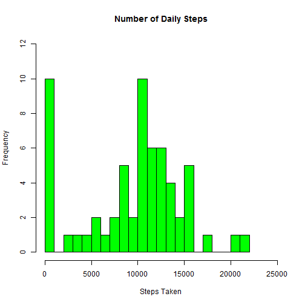

Analyze, graph, and report on the activity of an anonymous individual using 2 months 
of data gathered from their personal activity monitoring device (e.g. fitbit).

Load the data


```r
activity_all <- read.csv(file="./activity.csv", header=TRUE)
```


The total number of steps taken each day while ignoring missing data.
 

The mean number of steps per day:

```
## [1] 9354.23
```

The median number of steps per day:

```
## [1] 10395
```

Average number of steps taken across all days within a 5 minute interval while 
ignoring missing values:

 

What time 5-minute time interval, on average, contains the maximum number of steps?


```
## [1] 835
```

Impute the missing steps data from the original data:


```r
# impute missing values by using the average number of steps for an interval as
# the imputed value
activity_w_values <- activity_all
for (n in 1:NROW(activity_w_values)){
    if (is.na(activity_w_values$steps[n])){
        activity_w_values$steps[n] <- 
        avg_steps_interval$avg_steps[which(activity_w_values$interval[n]==avg_steps_interval$interval)]
    }
}
```

Total number of steps taken each days using imputed values:

 

Compare the average number of steps taken per 5-minute interval across weekdays
and weekends:

 
